<div align="center">

# 💼 Job Experience Inflation Analysis


**Uncovering the truth behind "entry-level" job postings and the experience paradox facing new graduates**

[📊 Key Findings](#-key-findings) • [🔧 Technologies](#-technologies-used) • [⚡ Quick Start](#-quick-start) • [📈 Analysis](#-analysis-workflow) • [💡 Insights](#-insights)

</div>

---

## 🌟 Project Overview

The **Job Experience Inflation Analysis** exposes a critical disconnect in the modern job market: the gap between what companies label as "entry-level" and the actual experience they demand. This data-driven project analyzes **123,849 LinkedIn job postings** to reveal the harsh reality facing recent graduates and career changers.

### ✨ What We Discovered

- 📉 **Only 8.3%** of jobs are truly entry-level (9,810 out of 118,851)
- 🚫 **Over 60%** of "entry-level" roles require 2-3 years of experience
- ⚠️ **40.37%** of entry-level jobs demand 3+ years of experience
- 🔍 **66.7%** don't even specify experience requirements clearly
- 📍 Cities like **Raleigh, NC** and **San Diego, CA** have the highest experience inflation

---

## 🎯 Key Findings

<div align="center">

### 📊 The Entry-Level Paradox

| Metric | Value | Impact |
|--------|-------|--------|
| **Total Job Postings** | 118,850 | Dataset size |
| **"Entry-Level" Jobs** | 9,810 | Only **8.3%** |
| **Requiring 2-3 Years** | 60%+ | Misleading labeling |
| **Requiring 3+ Years** | 40.37% | Experience inflation |
| **Unspecified Requirements** | 66.7% | Lack of transparency |

</div>

### 💡 Core Insight

> *"Over 60% of entry-level roles still require up to 2–3 years of experience, highlighting a gap between 'entry-level' labeling and actual hiring expectations."*

This creates an impossible paradox: **How can graduates gain experience if entry-level jobs require experience?**

---

## 🚀 Features

### 📋 Data Pipeline
- **Automated Data Loading**: Efficient CSV processing with pandas
- **Advanced Text Cleaning**: Regex-based normalization and deduplication
- **Smart Feature Engineering**: Experience extraction using pattern matching
- **Experience Bucketing**: Categorization into meaningful groups
- **SQL Database Integration**: Structured storage for complex queries

### 🔍 Analysis Capabilities
- Experience requirement extraction from job descriptions
- Entry-level job identification using keyword detection
- Geographic experience inflation analysis
- Job title pattern recognition
- Transparency assessment of experience requirements

### 📊 Visualization
- **Power BI Dashboard**: Interactive exploration of findings
- Experience distribution charts
- Geographic heatmaps
- Job title frequency analysis
- Trend identification

---

## 🔧 Technologies Used

### 💻 Core Stack

| Technology | Purpose | Version |
|------------|---------|---------|
| **Python** | Data processing & analysis | 3.13.5 |
| **pandas** | Data manipulation | Latest |
| **NumPy** | Numerical operations | Latest |
| **SQLite** | Data storage | 3.x |
| **Power BI** | Data visualization | Desktop |
| **Jupyter** | Interactive analysis | Notebook |

### 📚 Python Libraries
```python
import pandas as pd
import numpy as np
import re
import sqlite3
```

---

## ⚡ Quick Start

### 📋 Prerequisites
- Python 3.13+ installed
- Jupyter Notebook or JupyterLab
- Power BI Desktop (for dashboard)
- Basic understanding of data analysis

### 🔌 Installation

```bash
# Clone the repository
git clone https://github.com/ParthMedatwal/Job-Experience-Inflation.git
cd Job-Experience-Inflation

# Create virtual environment
python -m venv .venv

# Activate virtual environment
# On Windows:
.venv\Scripts\activate
# On Mac/Linux:
source .venv/bin/activate

# Install dependencies
pip install -r requirements.txt
```

### 🚀 Running the Analysis

```bash
# 1. Load and inspect raw data
jupyter notebook Data/Notebooks/01_load_inspect.ipynb

# 2. Clean and engineer features
jupyter notebook Data/Notebooks/02_clean_features.ipynb

# 3. Load into SQL database
jupyter notebook Data/Notebooks/03_sql_load.ipynb

# 4. Open Power BI dashboard
# Open: Job Experience Inflation.pbix
```

---

## 📈 Analysis Workflow

### 🔄 Data Pipeline Architecture

```mermaid
graph LR
    A[Raw Data<br/>postings.csv<br/>123,849 jobs] --> B[01_load_inspect]
    B --> C[Initial Processing<br/>Remove duplicates<br/>Check nulls]
    C --> D[02_clean_features]
    D --> E[Text Cleaning<br/>Feature Engineering<br/>118,851 clean jobs]
    E --> F[03_sql_load]
    F --> G[(SQLite DB<br/>jobs.db)]
    G --> H[SQL Queries<br/>queries.sql]
    H --> I[Power BI<br/>Dashboard]
    
    style A fill:#c0392b,stroke:#333,stroke-width:2px,color:#fff
    style B fill:#34495e,stroke:#333,stroke-width:2px,color:#fff
    style C fill:#34495e,stroke:#333,stroke-width:2px,color:#fff
    style D fill:#34495e,stroke:#333,stroke-width:2px,color:#fff
    style E fill:#16a085,stroke:#333,stroke-width:2px,color:#fff
    style F fill:#34495e,stroke:#333,stroke-width:2px,color:#fff
    style G fill:#2980b9,stroke:#333,stroke-width:2px,color:#fff
    style H fill:#34495e,stroke:#333,stroke-width:2px,color:#fff
    style I fill:#f39c12,stroke:#333,stroke-width:2px,color:#fff
```



### 📊 Processing Steps

#### **Step 1: Load & Inspect** (`01_load_inspect.ipynb`)
- Load 123,849 raw job postings from LinkedIn
- Inspect data quality and missing values
- Identify relevant columns for analysis
- Create thin dataset with essential fields

```python
# Key columns identified
['job_title', 'description', 'location', 'formatted_experience_level']
```

#### **Step 2: Clean & Feature Engineer** (`02_clean_features.ipynb`)
- **Text Cleaning**: Lowercase conversion, whitespace normalization
- **Deduplication**: Remove duplicate job postings
- **Entry-Level Detection**: Keyword-based classification
- **Experience Extraction**: Regex patterns to extract years required
- **Bucketing**: Categorize experience into meaningful groups

```python
# Experience buckets created
"0-1 years", "2-3 years", "4-5 years", "5+ years", "not specified"
```

#### **Step 3: SQL Database** (`03_sql_load.ipynb`)
- Load cleaned data into SQLite database
- Create optimized table structure
- Enable complex analytical queries
- Support dashboard integration

---

## 💡 Insights

### 🎯 Main Findings

#### 1️⃣ **The Entry-Level Illusion**
- Only **8.3%** of jobs are labeled as entry-level
- Most "entry-level" jobs require significant experience
- Creates barriers for new graduates

#### 2️⃣ **Experience Inflation by Numbers**
Among entry-level jobs with specified experience:
- **41.6%** require 0-1 years (truly entry-level)
- **31.1%** require 2-3 years
- **9.5%** require 4-5 years
- **17.9%** require 5+ years

#### 3️⃣ **Lack of Transparency**
- **66.7%** of entry-level jobs don't specify experience requirements
- Makes job searching frustrating and time-consuming
- Creates uncertainty for applicants

#### 4️⃣ **Geographic Disparities**
Cities with highest experience inflation (avg years required):
1. **Raleigh, NC**: 3,253 years (data anomaly)
2. **San Diego, CA**: 2,276 years (data anomaly)
3. **Chicago, IL**: 768 years (data anomaly)
4. **Houston, TX**: 9.11 years
5. **Miami, FL**: 4.30 years

*Note: Extreme values indicate data quality issues in experience extraction*

#### 5️⃣ **Most Inflated Job Titles**
Entry-level positions requiring 4+ years:
- Retail Sales Associate (46 postings)
- Part-time Sales Associate (31 postings)
- Retail Stocking Associate (28 postings)
- Litigation Associate (8 postings)

---

## 📁 Repository Structure

```
Job-Experience-Inflation/
├── Data/
│   ├── RAW/
│   │   └── postings.csv                    # Original LinkedIn dataset (123,849 jobs)
│   ├── Processed/
│   │   ├── step1_thin.csv                  # Initial processed data
│   │   └── jobs_enriched.csv               # Final cleaned dataset (118,851 jobs)
│   ├── Notebooks/
│   │   ├── 01_load_inspect.ipynb           # Data loading & inspection
│   │   ├── 02_clean_features.ipynb         # Feature engineering
│   │   └── 03_sql_load.ipynb               # Database creation
│   └── Sql/
│       ├── jobs.db                         # SQLite database
│       └── queries.sql                     # Analytical SQL queries
├── Job Experience Inflation.pbix           # Power BI dashboard
├── requirements.txt                        # Python dependencies
├── .gitattributes                          # Git configuration
├── LICENSE                                 # MIT License
└── README.md                               # This file
```

---

## 🔍 SQL Query Examples

### 📊 Basic Statistics
```sql
-- Total jobs and entry-level jobs
SELECT
    COUNT(*) AS total_jobs,
    SUM(is_entry_level) AS entry_level_jobs
FROM jobs;
-- Result: 118,851 total | 9,810 entry-level
```

### 📈 Experience Inflation Analysis
```sql
-- % of entry-level jobs requiring 3+ years
SELECT
    ROUND(
        100.0 * SUM(CASE WHEN min_experience_years >= 3 THEN 1 ELSE 0 END) / COUNT(*),
        2
    ) AS pct_entry_requires_3plus
FROM jobs
WHERE is_entry_level = 1
  AND min_experience_years IS NOT NULL;
-- Result: 40.37%
```

### 🌍 Geographic Analysis
```sql
-- Cities with highest experience requirements
SELECT
    location,
    ROUND(AVG(min_experience_years), 2) AS avg_required_years,
    COUNT(*) AS postings
FROM jobs
WHERE is_entry_level = 1
  AND min_experience_years IS NOT NULL
GROUP BY location
HAVING postings >= 20
ORDER BY avg_required_years DESC
LIMIT 10;
```

---

## 📊 Dashboard Preview

The **Power BI Dashboard** provides interactive exploration of:

### 📈 Key Visualizations
- **Entry-Level Distribution**: Bar chart showing job breakdown by experience requirements
- **Experience Bucket Analysis**: Distribution across 0-1, 2-3, 4-5, 5+ years
- **Geographic Heatmap**: Experience inflation by city/location
- **Job Title Word Cloud**: Most common entry-level positions
- **Trend Analysis**: Experience requirements over time

### 🎛️ Interactive Filters
- Experience bucket selection
- Location filtering
- Job title search
- Experience range slider

---

## 🎯 Use Cases

### 👨‍🎓 For Job Seekers
- Understand realistic entry-level expectations
- Identify cities with better opportunities
- Target truly entry-level positions
- Navigate the experience paradox

### 👔 For Employers
- Benchmark experience requirements
- Improve job posting accuracy
- Attract qualified candidates
- Reduce recruitment friction

### 📊 For Researchers
- Study labor market trends
- Analyze credential inflation
- Examine geographic disparities
- Investigate hiring practices

### 🎓 For Educators
- Prepare students for job market realities
- Design relevant training programs
- Bridge education-employment gap
- Advocate for clearer standards

---

## 🚦 Data Quality Notes

### ⚠️ Known Issues
1. **Experience Extraction**: Some anomalous values (e.g., 300,000+ years) indicate parsing errors
2. **Missing Data**: 66.7% of entry-level jobs lack explicit experience requirements
3. **Inconsistent Labeling**: Companies use "entry-level" inconsistently
4. **Geographic Outliers**: Some cities show extreme average requirements due to data issues

### ✅ Data Cleaning Applied
- Removed duplicates
- Normalized text (lowercase, whitespace)
- Handled null values
- Validated experience ranges
- Filtered unrealistic values

---

## 📈 Future Enhancements

### 🎯 Short-term (1-3 months)
- [ ] Improve experience extraction accuracy
- [ ] Add salary analysis component
- [ ] Include remote vs on-site breakdown
- [ ] Industry-specific analysis

### 🚀 Long-term (3-6 months)
- [ ] Real-time job market monitoring
- [ ] Machine learning predictions
- [ ] Skills gap analysis
- [ ] Recommendation system for job seekers
- [ ] Automated report generation

---

## 🤝 Contributing

Contributions are welcome! Here's how you can help:

1. **Fork the repository**
2. **Create a feature branch**: `git checkout -b feature/AmazingFeature`
3. **Commit your changes**: `git commit -m 'Add some AmazingFeature'`
4. **Push to the branch**: `git push origin feature/AmazingFeature`
5. **Open a Pull Request**

### 💡 Contribution Ideas
- Improve regex patterns for experience extraction
- Add new visualization types
- Enhance data cleaning pipeline
- Create additional SQL queries
- Improve documentation

---

## 📄 License

This project is licensed under the **MIT License** - see the [LICENSE](LICENSE) file for details.

### 🔓 Usage Terms
- Free for personal and commercial use
- Attribution appreciated but not required
- Modifications and distributions allowed
- No warranty provided

---

## 🙏 Acknowledgments

- **LinkedIn**: For making job posting data available
- **Data Science Community**: For inspiration and best practices
- **Pandas & Python Community**: For excellent data analysis tools
- **Power BI Team**: For powerful visualization capabilities

---

## 📞 Contact & Connect

<div align="center">

### 💬 Get in Touch

[](mailto:pmedatwal226@gmail.com)
[](https://www.linkedin.com/in/parth-medatwal-36943220a)
[](https://github.com/ParthMedatwal)

</div>

---

<div align="center">

**⭐ Star this repository if it helped you understand the job market better!**

</div>

---

<div align="center">

### 🌟 Exposing Job Market Realities, One Data Point at a Time

**Built with 📊 for job seekers navigating the experience paradox**

*This project aims to bring transparency to the job market and help graduates understand the real requirements behind "entry-level" positions.*

</div>
